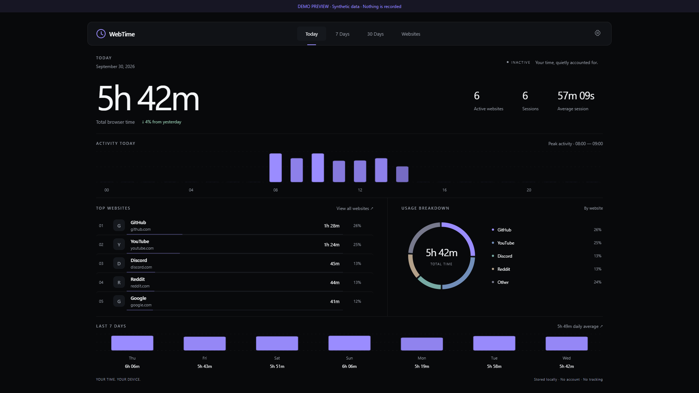
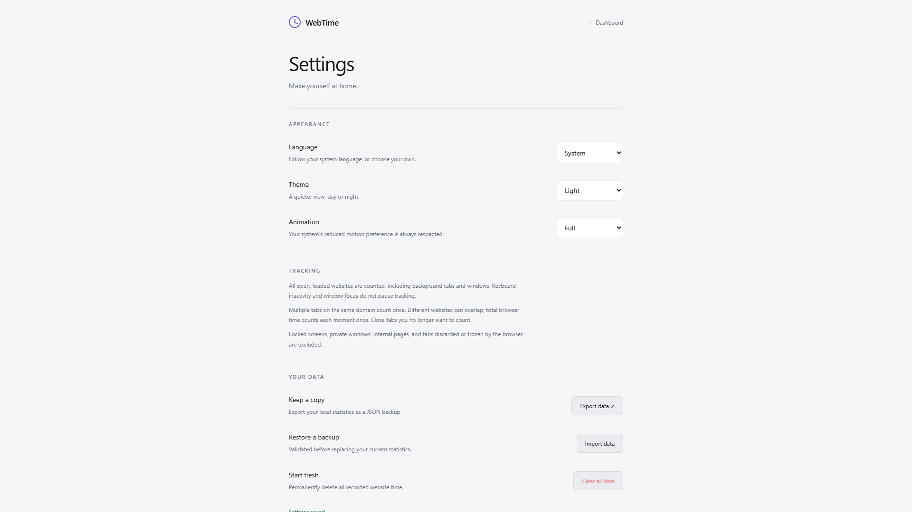
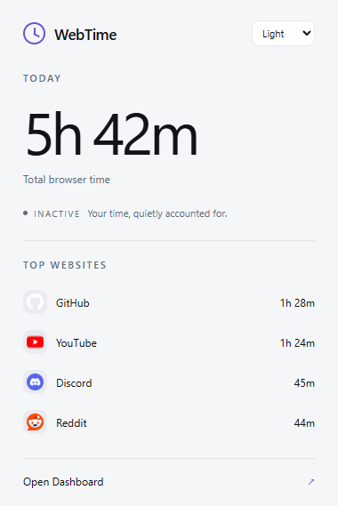

# WebTime

**Know where your browser time goes. Keep it on your device.**

English · [简体中文](README.zh-CN.md)

WebTime is a local-only browser screen time tracker for Chrome and Chromium browsers. A calm dashboard, useful detail, and no accounts, servers or telemetry. Built with Manifest V3 and vanilla JavaScript, HTML and CSS — **no build step or package installation required**. Main-domain detection uses a bundled offline library.



<details>
<summary>More screenshots: light settings and popup</summary>





</details>

Screenshots are rendered in a real browser using synthetic demo data, not anyone's browsing history.

## Features

- **Today at a glance:** total time, change from yesterday, hourly activity, top websites, usage shares and the last seven days.
- **7- and 30-day views:** daily averages, trends, website totals and an hourly browser-rhythm heatmap.
- **Website details:** searchable, sortable history with per-domain daily activity.
- **Merged subdomains:** one clock per main domain, with collapsed rows that expand into individual domain-duration charts.
- **Focused popup:** today's total, live state and top websites.
- **Dark, light and system themes**, keyboard access and reduced/off motion preferences.
- **Eight interface languages:** Chinese, English, Japanese, Korean, German, Italian, Russian and Spanish. Language defaults to **System** (Chrome's preferred languages), with a manual override in Settings. Unsupported preferences fall back to English. Dates and time units follow the selected language; website names stay unchanged.
- **Local JSON backups:** export, validated replacement import and confirmed clearing.

## Install

1. Download this repository's source ZIP and extract it, or clone it.
2. Open `chrome://extensions` (or `edge://extensions`) and enable **Developer mode**.
3. Choose **Load unpacked** and select the repository root — the directory containing `manifest.json`.
4. Pin WebTime to the toolbar. Browse normally, then open the popup and select **Open Dashboard**.

Chrome/Chromium 132+ is required. No npm install is needed for normal use. New installations start with empty statistics. This repository does not provide a Chrome Web Store listing.

### Updating from ScreenTime

Reload the extension at the same path with the same extension ID. Existing storage keys are unchanged. Version-1 and version-2 histories/backups migrate automatically to version 3; old ScreenTime JSON backups remain importable. Version-3 exports require WebTime 1.2.1 or newer. New exports use `webtime-backup-YYYY-MM-DD.json`.

Old version-2 subdomain totals are summed and labeled when they may contain overlaps: old versions stored aggregate buckets, so historical overlaps cannot be recovered accurately. Browser totals and individual hostname histories remain unchanged. New main-domain intervals are deduplicated.

If you move the installation or change extension ID, export a backup first and import it into the new installation. Keep the folder name unchanged while testing an existing unpacked installation.

## What counts as browser time?

Time is recorded for **all open, loaded HTTP(S) tabs in normal browser windows**, including background tabs and unfocused/minimized windows. Keyboard inactivity does not pause tracking. Private tabs, internal pages, discarded/frozen tabs and OS-locked time are excluded.

**One main domain, one clock.** `bilibili.com` and `space.bilibili.com` open together for 20 minutes count as 20 minutes of Bilibili. Google Search, Gmail and Google Docs all belong to `google.com`. YouTube and GitHub open together for 20 minutes each show 20 minutes, while total browser time remains 20 minutes. The main total and activity charts count the union of these intervals. Website percentages and the ring use the sum of main-domain times, so their shares add up to 100%; this sum may exceed total browser time.

Website rows are collapsed by default. Click a merged row to see hostname durations and bars, then open the group's or a hostname's detail page. Search also finds child hostnames. Child times can overlap and therefore may add up to more than the main-domain total.

There is no idle threshold or media-playback detection. A paused video or unread background tab continues counting while it remains loaded. Close tabs you no longer want to count. WebTime measures open-website time, not attention or verified playback.

Hostnames are normalized by removing `www.` and grouped using the bundled ICANN Public Suffix List, including multi-part suffixes such as `co.uk` and `com.cn`. All subdomains of a registrable domain are merged, including shared hosting; private-suffix exceptions are not used. Country domains such as `google.com` and `google.co.jp` remain separate. IP addresses and single-label hosts remain separate. Intervals are split into local calendar-day and hour buckets. A main-domain session continues while at least one eligible tab for any of its hostnames remains open. Existing history is not rebucketed after a timezone change.

**Accuracy limits:** Chrome may delay background alarms or terminate its worker. WebTime checkpoints about every 20 seconds while running and uses a 30-second alarm fallback. Gaps longer than 45 seconds and backwards clock changes are discarded conservatively. Crashes or heavy background throttling can lose unconfirmed time; sleeping/closed time is not deliberately backfilled. It is not a billing-grade stopwatch.

## Privacy

Statistics stay in `chrome.storage.local`. Full URLs, queries, page titles and page contents are not saved. A transient `storage.session` marker distinguishes worker recovery from browser restart. Favicons come from the browser-managed endpoint; WebTime uses no third-party favicon service.

| Permission | Purpose                             |
| ---------- | ----------------------------------- |
| `tabs`     | Determine open websites' hostnames  |
| `idle`     | Pause on OS lock only               |
| `storage`  | Store local statistics and settings |
| `alarms`   | Checkpoint and recover tracking     |
| `favicon`  | Display browser-managed icons       |

Backups contain domains and timestamps. Keep them private. See [PRIVACY.md](PRIVACY.md) for retention, export and deletion details. Imports are limited to 8 MB and normal Chrome local-storage quotas apply.

## Development

Use **Node.js 22+**. Playwright and Prettier are development-only dependencies.

```sh
npm ci
npm test
npx playwright install chromium
npm run test:ui
npm run test:extension
npm run format:check
```

On Linux, install browser system dependencies with `npx playwright install --with-deps chromium`. Browser tests use Playwright's full Chromium by default; `CHROME_PATH` can select a recent Chrome executable. The extension smoke test needs the `Extensions.loadUnpacked` debugging command.

For a local UI preview with Python:

```sh
python -m http.server 8765 --bind 127.0.0.1
```

Visit `http://127.0.0.1:8765/dashboard/index.html?demo`. Demo statistics are synthetic and stay in page memory; actual tracking requires the installed extension.

## Project layout

```text
background/     Browser events and serialized persistence
tracking/       Interval accounting, summaries and backup validation
storage/        Atomic local-storage wrapper
shared/         UI utilities and theme styles
dashboard/      Views and custom SVG charts
popup/          Toolbar popup
settings/       Preferences and backup controls
assets/         Local extension icons
vendor/         Bundled offline domain parser and license
tests/          Core, browser and extension checks
docs/           Architecture and public demo screenshots
```

[Testing and manual acceptance](TESTING.md) · [Architecture](docs/architecture.md) · [Contributing](CONTRIBUTING.md) · [Security](SECURITY.md) · [Changelog](CHANGELOG.md)

## License

[MIT](LICENSE) © 2026 WebTime contributors. Bundled [tldts](vendor/tldts/README.md) retains its own license and Public Suffix List attribution.
