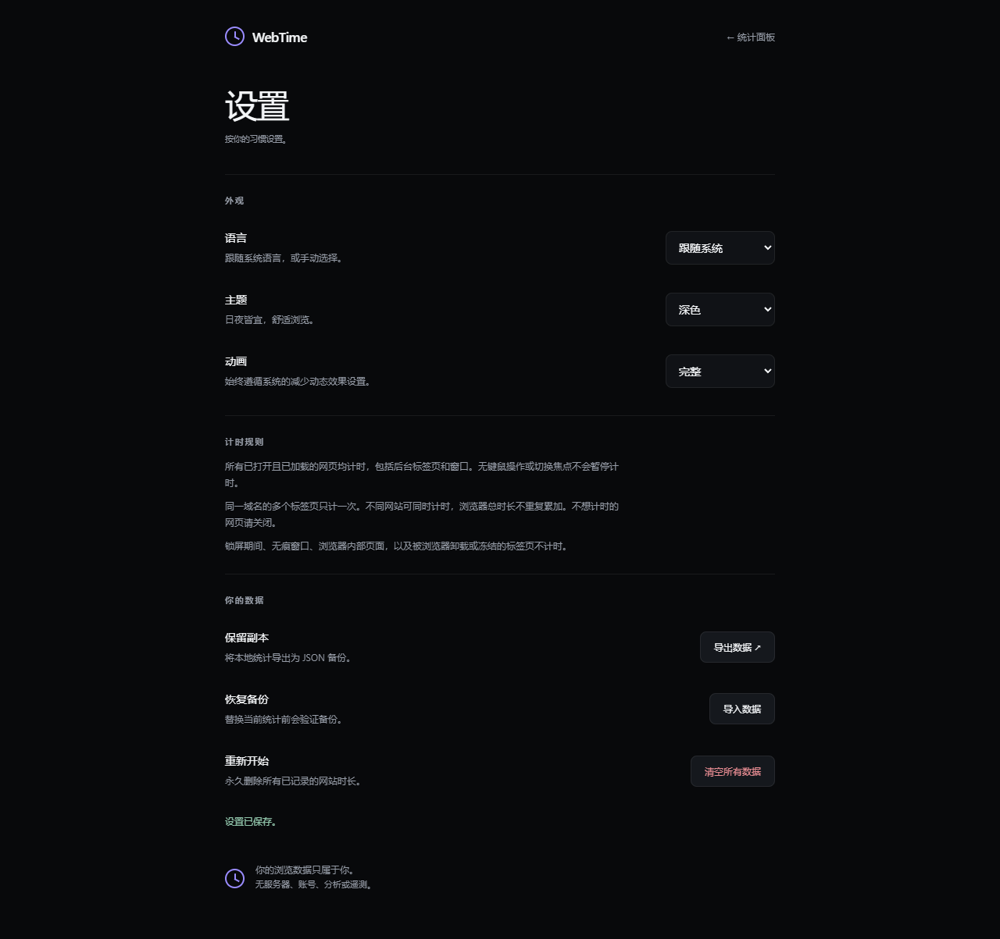

# WebTime

支持中文、英语、日语、韩语、德语、意大利语、俄语和西班牙语。语言默认**跟随系统**（使用 Chrome 的首选语言），也可在「设置 → 语言」手动选择。不支持的语言回退到英语。日期和时长单位随语言切换，网站名称保持原样。

[English](README.md) · **简体中文**


<details>
<summary>更多截图：浅色设置与 Popup</summary>





</details>

截图来自真实浏览器渲染，使用合成演示数据，不代表个人浏览记录。

一个零运行时依赖、Manifest V3、本地优先的浏览器使用时间扩展。原生 JavaScript / HTML / CSS，无需构建、安装 npm 依赖或注册账户。

## 安装

1. 在 Chrome 打开 `chrome://extensions`（Edge 使用 `edge://extensions`）。
2. 开启「开发者模式」，点击「加载已解压的扩展程序」。
3. 选择本 README 所在的 项目根文件夹（名称可以是 `webtime` 或 `screen-time`），确保该文件夹直接包含 `manifest.json`。
4. 将 WebTime 固定在工具栏。正常浏览网页后，点击扩展图标，再点击 **Open Dashboard**。

要求 Chrome / Chromium 132+。首次安装的数据为空；不会向真实记录写入演示数据。

## 功能

- Today：今日总时间、昨日变化、网站数、会话数、平均会话、24 小时活动、网站排行与占比、联动环图、最近七天。
- 7 Days / 30 Days：包含今天的滚动周期、每日平均、每日活动、周期网站排行、最近七天的逐小时 Browser Rhythm。
- Websites：全部历史网站、搜索、按时间 / 最近访问 / 名称排序、30 天网站详情。
- 独立 Popup、Dark / Light / System、Full / Reduced / Off 动画、键盘焦点与图表提示。
- JSON 导出、严格校验且需确认的替换导入、二次确认清空。
- 统计页面每 5 秒取得最新快照，实时状态秒级显示；更新保留现有 DOM 与键盘焦点。

## 统计口径与准确性边界

统计正常浏览器窗口中**所有已打开、已加载的 HTTP(S) 标签页**，包括后台标签页、失焦或最小化窗口。不再检测键鼠操作，也不设置闲置阈值。内部页面、无痕标签页、被浏览器卸载/冻结的标签页及锁屏期间不计时。

**同一域名去重，不同域名并行，总时长去重。** 两个 YouTube 标签页同时打开 20 分钟，YouTube 只记 20 分钟；YouTube 和 GitHub 同时打开 20 分钟，各自记 20 分钟，浏览器总时长仍是 20 分钟。主数字和活动图使用去重总时间；网站占比和环图使用网站时长合计为分母，因此占比合计仍是 100%，但网站时长合计可能大于浏览器总时长。

不检测视频播放状态：暂停的视频、没有阅读的后台标签页，只要仍处于加载状态，也会计时。关闭不想计时的标签页即可停止。这是网页打开时长，不代表注意力或真实播放时长。

- 按本机当地日期和小时拆分间隔；移除域名前导 `www.`，其他子域保持独立。不合并 `google.com` 与 `google.co.jp`。
- 同一域名至少有一个符合条件的标签页打开时，会话连续；关闭最后一个标签页、锁屏或恢复中断后重新开始会话。会话数归于会话开始日期。
- 服务线程运行时每 20 秒保存，浏览器事件触发时保存，并设 30 秒 alarm 作恢复保障。总量与检查点在同一个 storage key 中原子保存。
- `storage.session` 的标记区分后台线程重启和浏览器重启，避免把浏览器关闭期间计入历史。
- Chrome 不保证定时唤醒；间隔超过 45 秒或系统时钟倒退时，丢弃无法可靠确认的整段间隔。异常崩溃可能损失最后一个未保存周期；后台严重节流时可能少计。不会声称在休眠/崩溃场景能做到秒级绝对准确。
- 历史按记录当时的本地日期保留；更改系统时区不会重新划分旧记录。
- 保存使用 Chrome 默认本地配额，不额外申请 unlimitedStorage。配额错误会保留已有磁盘数据并返回错误；备份导入限 8 MB。

官方依据：[Service Worker 生命周期](https://developer.chrome.com/docs/extensions/develop/concepts/service-workers/lifecycle)、[Alarms](https://developer.chrome.com/docs/extensions/reference/api/alarms)、[Idle](https://developer.chrome.com/docs/extensions/reference/api/idle)、[本地 favicon API](https://developer.chrome.com/docs/extensions/how-to/ui/favicons)。

## 隐私与权限

所有统计仅写 `chrome.storage.local`。不读取历史、不上传数据、不使用远端字体/脚本/图标、无账号、无服务器、无遥测。只保存域名、由域名确定的显示名、每日/每小时秒数、会话数与最后统计时间。不保存访问路径、query、完整 URL、网页标题或 favicon URL。

权限只有：

| 权限    | 用途                                |
| ------- | ----------------------------------- |
| tabs    | 确定已打开标签页的域名              |
| idle    | 仅用 locked 状态检测锁屏            |
| storage | 本地统计与浏览器会话标记            |
| alarms  | 后台定期检查点与恢复                |
| favicon | 从浏览器自己的 favicon 缓存显示图标 |

favicon 通过扩展的 `_favicon` 端点查询，仅传域名根地址，不直接加载网站的 `favIconUrl`，避免任意远端图标请求；失败则显示首字母。没有第三方 favicon API。CSP 禁止网络连接和远端脚本。

## 本地预览

在此目录执行：

```powershell
python -m http.server 8765 --bind 127.0.0.1
```

打开 `http://127.0.0.1:8765/dashboard/index.html?demo` 查看明确标注的合成演示数据。去掉 `?demo` 是空状态预览。普通网页预览不会计时；安装扩展才会启用浏览器 API。演示设置仅在当前页面内存中保存。

## 开发与验证

扩展运行时不需要 Node、npm 或构建。贡献者使用 Node.js 22+：

```sh
npm ci
npm test
npx playwright install chromium
npm run test:ui
npm run test:extension
npm run format:check
```

Linux 可使用 `npx playwright install --with-deps chromium`。测试默认使用 Playwright 安装的完整 Chromium；可以用 `CHROME_PATH` 环境变量指定现代 Chrome。开发依赖不会成为扩展运行依赖。

测试截图位于被 Git 忽略的 `tests/artifacts/`；README 展示图位于 `docs/images/`。完整测试范围与人工验收步骤见 [测试说明](TESTING.md)。

## 从 ScreenTime 更新

在相同目录、相同扩展 ID 下重新加载即可。存储键不变，version-1 历史和备份会自动迁移为 version 2；旧版 JSON 备份仍可导入。新版导出需 WebTime 1.1.0 及以上才能读取。新导出文件名为 `webtime-backup-YYYY-MM-DD.json`。如果更换安装目录或扩展 ID，应先导出、再在新安装中导入备份。

## 开源

采用 [MIT 许可证](LICENSE)。欢迎提交 Issue / PR；参见 [贡献指南](CONTRIBUTING.md)、[隐私说明](PRIVACY.md)、[安全报告](SECURITY.md)和[更新记录](CHANGELOG.md)。

## 文件结构

```text
manifest.json              扩展清单
background/service-worker.js  浏览器事件、串行写入、恢复
tracking/core.js           域名处理、时间分桶、汇总、备份验证
storage/storage.js        原子本地存储封装
shared/                   共用样式、格式化、主题、图标、提示
dashboard/                导航、页面、自定义 SVG 图表
popup/                    工具栏弹窗
settings/                 设置、导入导出与确认弹窗
assets/icons/             本地扩展图标
tests/                    逻辑、浏览器及扩展测试
```
